# Project Proposal

Click [here](../proposal/) to view our project proposal.

# Progress Report

Click [here](../report/) to view our progress report.

# Analyse
We analyzed the paper ["Deep Visual-Semantic Alignments for Generating Image Descriptions"](https://cs.stanford.edu/people/karpathy/cvpr2015.pdf) by Andrej Karpathya and Li Fei-Fei and the paper ["Show and Tell: Lessons learned from the 2015 MSCOCO Image Captioning Challenge"](https://arxiv.org/pdf/1609.06647.pdf) by Vinyals et al. from Google.

In Deep Visual-Semantic Alignments for Generating Image Descriptions, they use [VGG16](http://www.robots.ox.ac.uk/~vgg/research/very_deep/) as their CNN. Their image captioning model is VGG16 combined with 2 layers of LSTM RNN. In their code, the base implementation is using [Torch](http://torch.ch/) as their deep learning framework. They use Flickr8K / Flickr30K / COCO as their datasets. 
# Process
## Introduction

## Implementation

### preprocessing/generator.py

There are two things happen in this file.

The `generator` function reads the data of captions and get a list of all the images. After that, it call `Caption Preprocessor` and feed all the captions so that the `Caption Preprocessor` can build dictionary like structure to store all the words and their index. Then, it call `Image Preprocessor` to convert all the images to a `np.array` with the shape (8000, 299, 299, 3). 8000 is the number of images. 299 is the size of each image. And 3 means three colors (RGB). In the end, it return an `Image Sequence` instance.

The `ImgSequence` (`Image Sequence`) class gets all the data of images, and captions and provides an iterable function `__getitem__`. Every time when the `fit_generator` calls `__getitem__`, it will choose `n` (`n = batch_size`) images randomly and then choose one of their captions randomly (each image has at least five captions). After that, it will encode the captions to a `np.array` with the shape (35, 31, 8389). 35 is the batch size. 31 is the sentence length. And 8389 is the length of the words dictionary. The inputs and outputs have one word difference. So if the input is `<sos> A dog with a red Frisbee flying in the air`, the output should be `A dog with a red Frisbee flying in the air <eos>`. In the end, the function wrap all the batch data together and return them to the `fit_generator`.

### preprocessing/caption_processing.py 

`Caption Preprocessor` provides functions to convert all the image captions to dictionary like structure. We use a text tokenization utility class called `Tokenizer` from `Keras` to handle most of the tasks. First,  it reads all the captions provided by `generator` and warps them with the starting tag `<sos>` and ending tag `<eos>`. After that, it fits the captions to the `Tokenizer` and get the dictionary results. It also provides functions for `ImgSequence` to encode the captions.

## Training

### Inception V3 + NVIDIA Tesla K80

We use Inception V3 as the pretrained image recognition model in this training. We use a machine from [Floyd](https://www.floydhub.com/) with NVIDIA Tesla K80 to do the training. It takes about 18 hours to finish 55 epochs. 

#### Training Accuracy

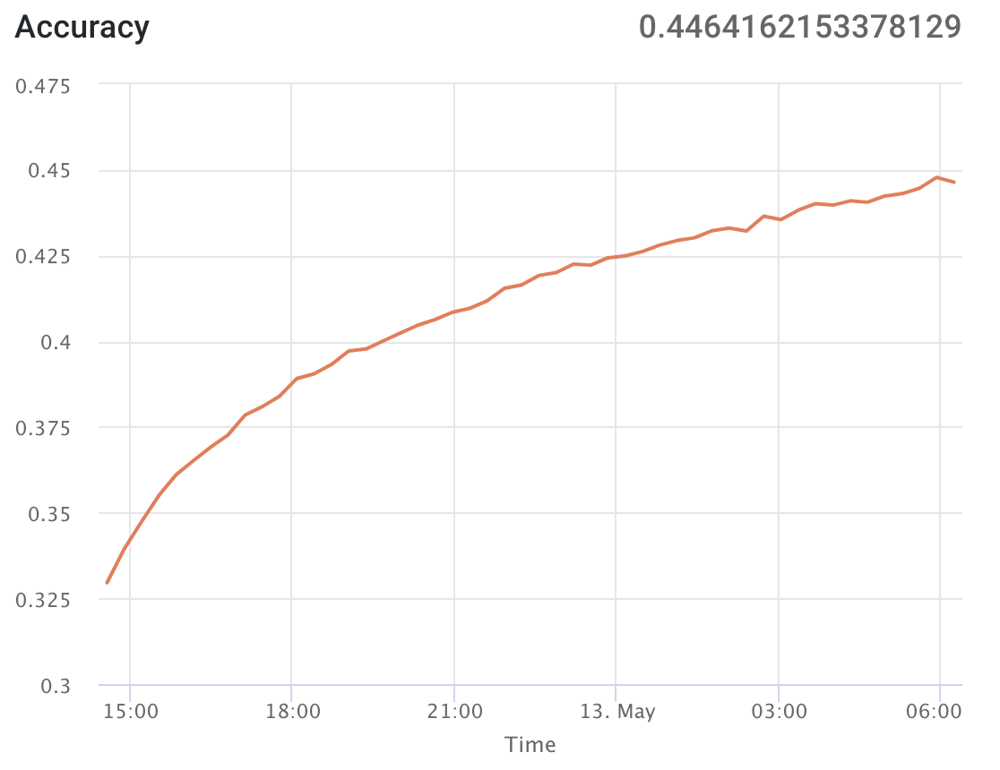

The training accuracy you see here starts at the sixth epoch. We trained the first five epochs to verify our model and then continued to the sixth training.

#### Training Loss

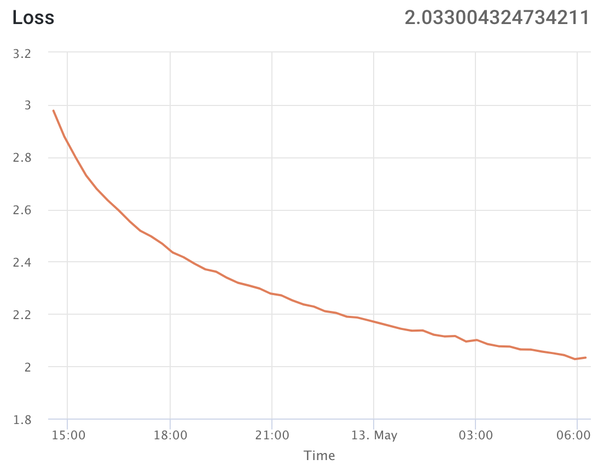

### Inception V4 + NVIDIA GeForce GTX 960M

# Results

We download some images from the internet randomly and take one photo by ourselves. Then, we let the model predicts the captions. Here are what we get.

## Inception V3 + NVIDIA Tesla K80

### Describes without Errors

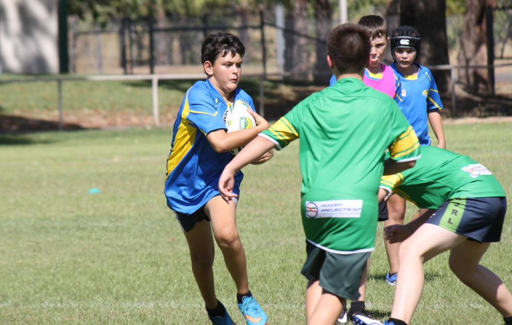

A group of men play soccer.

### Describes with Minor Errors

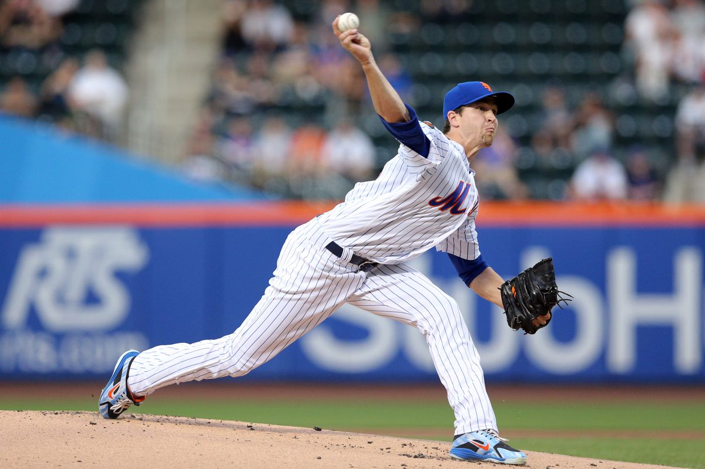

A man in a blue shirt is jumping in the air with a racquet.

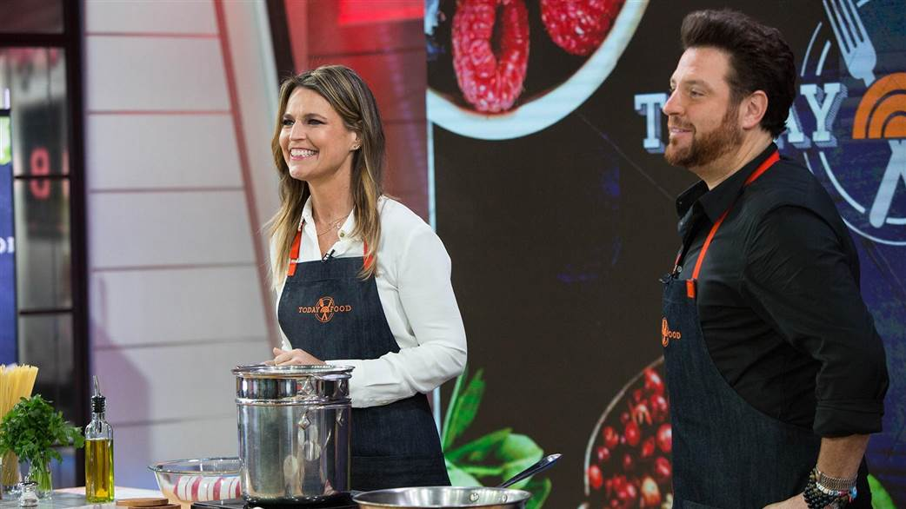

A man and a woman are standing in front of a restaurant.

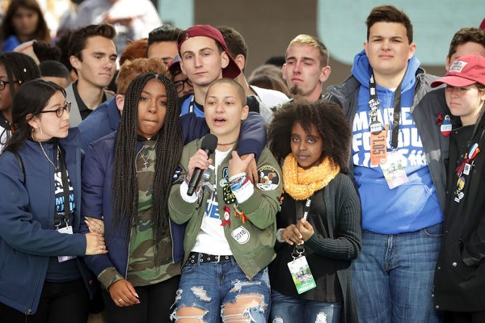

A group of people are standing together and one is holding a bottle.

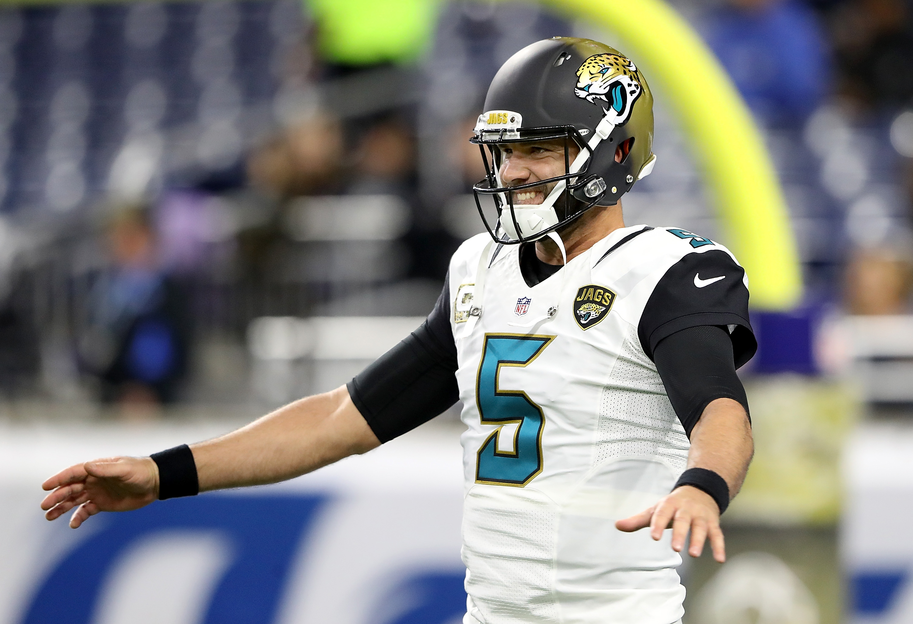

A football player in a sooners uniform with a football.

### Somewhat Related to the Image

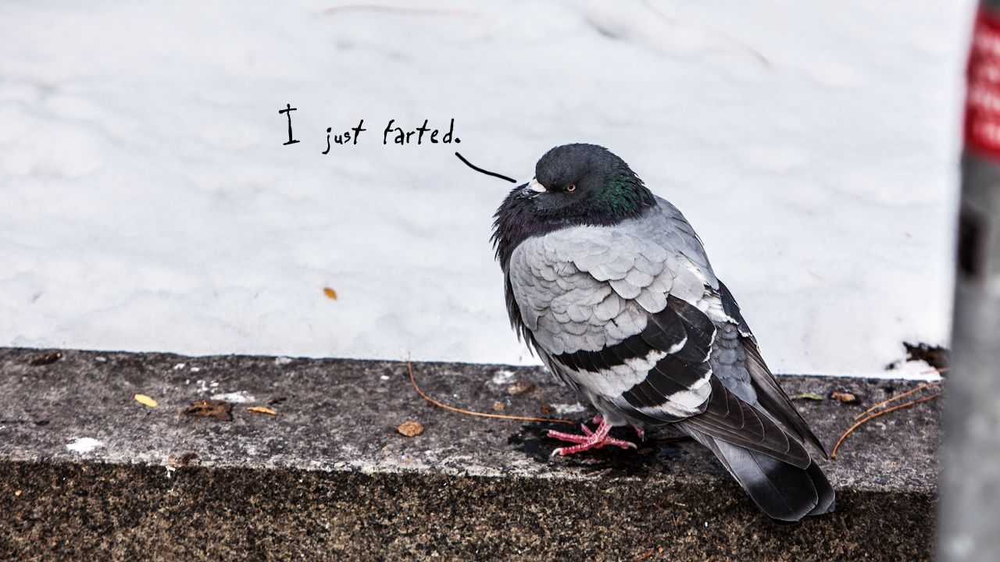

A bird is flying over the water.

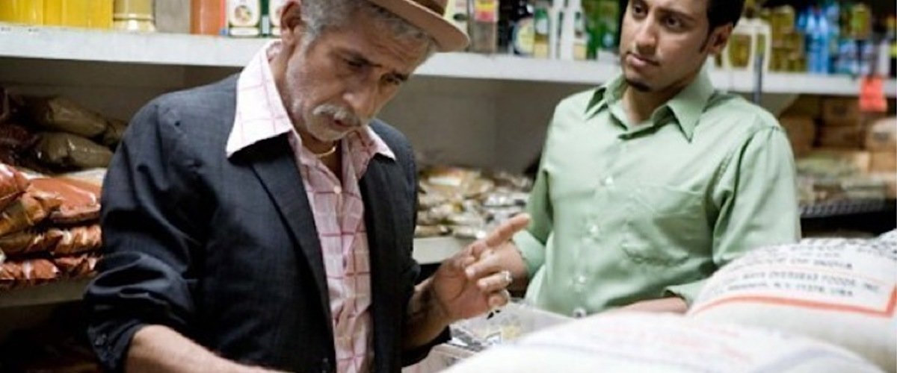

A man in a black shirt and a man in a black shirt and a man in a black shirt and white cap.

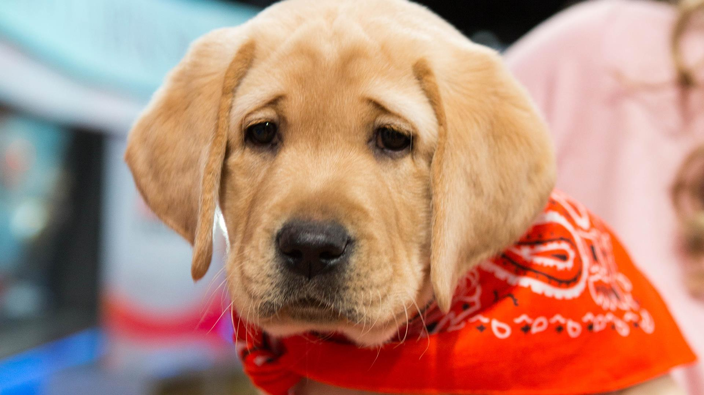

A dog is shaking off water.

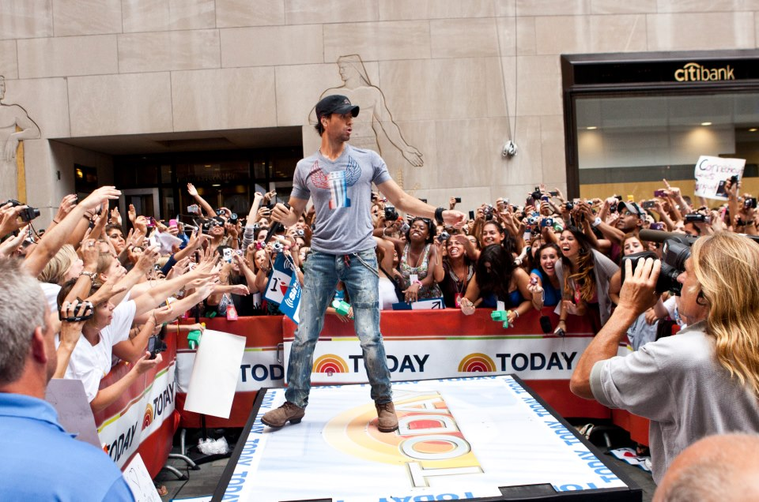

A group of people are dancing in a parade.

### Unrelated to the Image

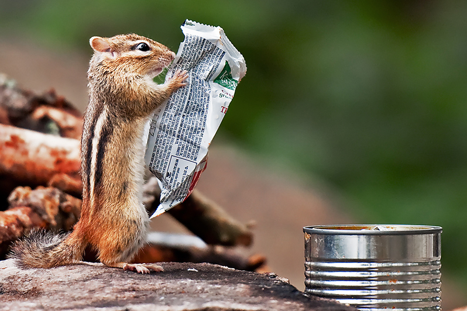

A dog is running through a grassy area.

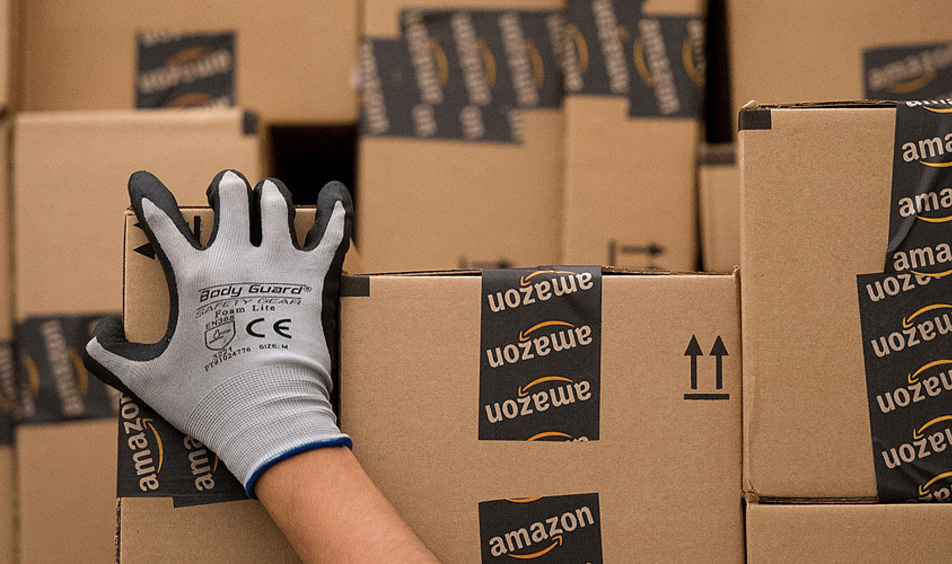

A woman in a black shirt is standing in front of a large display of art.

A man sits on a bench in front of a large building.

# Conclusion

